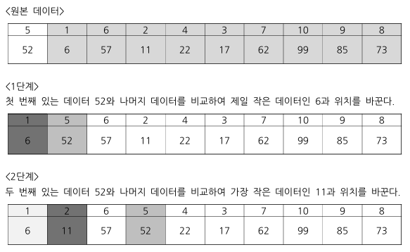
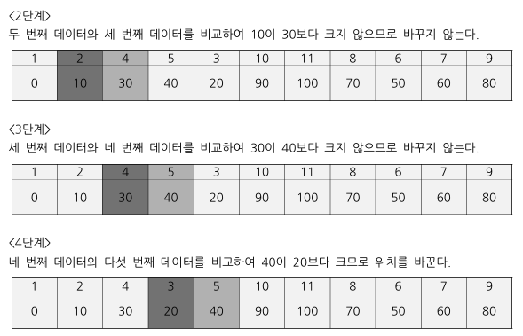
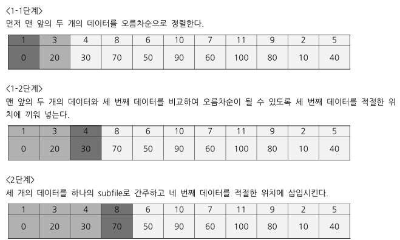

# 선택 정렬(Selection Sort)

선택 정렬은 정렬 방법 중에 가장 간단한 방법 중의 하나.

제일 처음에 있는 값을 가지고 나머지 값과 비교하여
제일 작은 작은 키 값을 가지는 데이터와 위치를 바꾼다 

다음 두 번째 위치한 데이터의 키를 가지고 
세 번째 이후의 데이터가 가지고 있는 키와 비교하여 
마찬가지로 제일 적은 키 값을 가지는 데이터와 위치를 바꾼다.

이렇게 해서 맨 마지막 바로 전 데이터와 마지막 데이터를 비교하는 순서까지 반복하면
데이터가 오름차순으로 정렬되게 된다.



## 특징

$n$ 개의 데이터 중 $i$ 개가 정렬되었다고 가정할 때 
나머지 $(n - i)$ 개 중 최소인 것을 찾아 번째 위치에 정렬시킨다.

입력 배열 외 다른 배열이 필요 없는 제자리 정렬이다.

선택정렬 알고리즘의 시간 복잡도는 최악평균최선 모두 $O(n^2)$이며, 비교회수는 $n(n-1)/2$가 된다

```python
arr = [52, 6, 57, 11, 22, 17, 62, 99, 85, 73]

def selection_sort(arr):
    for i in range(len(arr)):
        min_index = i

        for j in range(i + 1, len(arr)):
            if arr[min_index] > arr[j]:
                min_index = j
                
        arr[i], arr[min_index] = arr[min_index], arr[i]

    return arr
```

# 버블 정렬(Bubble Sort)

주어진 데이터에서 두 개의 인접한 데이터를 비교하여 
오름차순이면 작은 데이터를 왼쪽으로 
내림차순이면 큰 데이터를 오른쪽으로 위치시키면서
마지막 데이터까지 반복하는 것을 순차적으로 반복하여 정렬하는 방법을 말한다.

버블정렬을 한 번 실행할 때마다 오름차순의 경우 최대로 큰 값이 배열의 가장 마지막에 위치하게 된다.

따라서 열 개의 데이터가 있다면 
최초 실행 시에 가장 큰 값이 10 번째에 위치하게 되고 
두 번째 실행 시에는 9 번째 위치하게 되며 
세 번째 실행 시에는 8 번째 위치하게 된다.



```python
arr = [10, 0, 30, 40, 20, 90, 100, 70, 50, 60, 80]

def bubble_sort(arr):
    for i in range(len(arr)):
        for j in range(i, len(arr) - 1):
            if arr[j] > arr[j + 1]:
                arr[j], arr[j + 1] = arr[j + 1], arr[j]

    return arr
```

## 특징
버블 정렬의 성능은 첫 번째 단계에서는 (n-1) 번의 비교가 수행되고 두 번째 단계에서는 (n - 2) 번 수행된다 
i 번째 단계에서는 (n-i) 번을 비교한다 

따라서 평균 비교 횟수는 O(n^2)가 된다.

# 삽입 정렬(Insert Sort)

매우 간단한 방법으로 적은 양의 데이터를 처리하는데 매우 유용하다.

가장 먼저 첫 번째 데이터와 두 번째 데이터를 비교하여 오름차순으로 정렬한다.

이렇게 정렬된 2 개의 데이터를 하나의 subfile로 간주하고
이것과 세 번째 데이터를 비교하여 오름차순 정렬이 되도록 세 번째 데이터를 알맞은 위치에 삽입시킨다.

삽입할 원소보다 큰 것은 우측으로 하나씩 이동하고 빈자리에 삽입원소를 집어넣는다.



```python
arr = [64, 28, 33, 76, 55, 12, 43]

def insert_sort(arr):
    for i in range(len(arr) - 1):
        for j in range(i + 1, 0, -1):
            if arr[j] < arr[j - 1]:
                arr[j], arr[j - 1] = arr[j - 1], arr[j]
            else:
                break

    return arr
```

## 특징

성능은 최적일 경우 입력자료가 정렬하고자 하는 순서대로 배열되어 있는 경우로 최소 비교 횟
수는 (n -1)이 되며 
최악의 상황인 입력 자료가 역순으로 정렬되어 있는 경우의 최대 비교 횟수는 (n(n-1))/2가 된다.

중간 정도에서 부분적인 정렬이 완료되었을 경우 평균 비교 횟수는 (n(n-1))/4 이며
n 개의 레코드를 정렬할 때 (n - 1) 번 삽입이 발생되어 전체 수행시간은 O(n^2)가 된다.

별도의 배열이 필요 없는 제자리 정렬이다.

정렬 후에도 같은 값들의 상대 위치가 그대로 유지되는 안정적 정렬 알고리즘이다.

삽입정렬에서 최악의 경우는 역순으로 정렬된 것이고 최선의 경우는 이미 제 순서대로 정렬된 것이다.


# 쉘 정렬(Shell Sort)

삽입정렬의 확장 개념으로 입력 파일 안에 있는 데이터를 적당한 간격을 
기준으로 그 값만큼 떨어진 데이터들을 하나의 subfile로 간주한다.

간격을 기준으로 만들어진 각각의 subfile을 삽입정렬의 방법을 이용하여 데이터를 정렬하게 된다.

간격이 1이 될 때까지 반복한 후, 마지막으로 삽입 정렬을 실행한다.

```python
arr = [8, 7, 6, 5, 4, 3, 2, 1]


def shell_sort(arr):
    gap = len(arr) // 2

    # 간격이 1이 될 때까지 반복
    while gap > 1:
        for i in range(0, len(arr) - gap):
            if arr[i] > arr[i + gap]:
                arr[i], arr[i + gap] = arr[i + gap], arr[i]

        gap = gap // 2

    # 삽입 정렬 실행
    for i in range(len(arr) - 1):
        for j in range(i + 1, 0, -1):
            if arr[j] < arr[j - 1]:
                arr[j], arr[j - 1] = arr[j - 1], arr[j]
            else:
                break

    return arr
```

## 특징

제자리에서 멀리 떨어진 원소가 제자리를 빨리 잡을 수 있도록 하기 위해
멀리 떨어진 원소들에 대하여 삽입정렬을 행한다는 것으로 속도를 높혔다.

쉘 정렬 알고리즘의 시간 복잡도는 최악 O(n^2)이 된다.

# 분할 정복 알고리즘(Divide and conquer algorithm)

분할 정복 알고리즘은 해결하려고 하는 문제를 크기가 보다 작은 여러 개의 부분 문제로 분할한다.

크기가 작은 부분 문제에 대한 답으로부터 원래의 문제에 대한 해답을 쉽게 얻을 수 있게 분할할 필요가 있다.

다음은 분할 정복을 활용한 정렬이다.

- 합병 정렬
- 퀵 정렬
- 2진 탐색

분할 정복은 아래 3 가지 단계로 진행된다.

1. 분할 단계 : 원래 문제를 소문제로 분할
2. 정복 단계 : 소문제의 해를 순환적으로 구함
3. 합병 단계 : 소문제의 해를 합하여 원래 문제에 대한 해를 만듬

# 합병 정렬(Merge Sort)


```python
arr = [8, 7, 6, 5, 4, 3, 2, 1]


def merge_sort(arr):
    def divide_and_conquer(arr):
        if len(arr) <= 1:
            return arr

        # divide
        mid = len(arr) // 2

        left_arr = arr[:mid]
        right_arr = arr[mid:]

        # conquer
        left_arr = divide_and_conquer(left_arr)
        right_arr = divide_and_conquer(right_arr)

        return combine(left_arr, right_arr)

    def combine(left_arr, right_arr):
        sorted_arr = []

        left_idx, right_idx = 0, 0

        while left_idx < len(left_arr) and right_idx < len(right_arr):
            if left_arr[left_idx] < right_arr[right_idx]:
                sorted_arr.append(left_arr[left_idx])
                left_idx += 1

            else:
                sorted_arr.append(right_arr[right_idx])
                right_idx += 1

        # left_idx or right_idx will be out of range
        sorted_arr += left_arr[left_idx:]
        sorted_arr += right_arr[right_idx:]

        return sorted_arr

    return divide_and_conquer(arr)
```

# 퀵 정렬(Quick Sort)